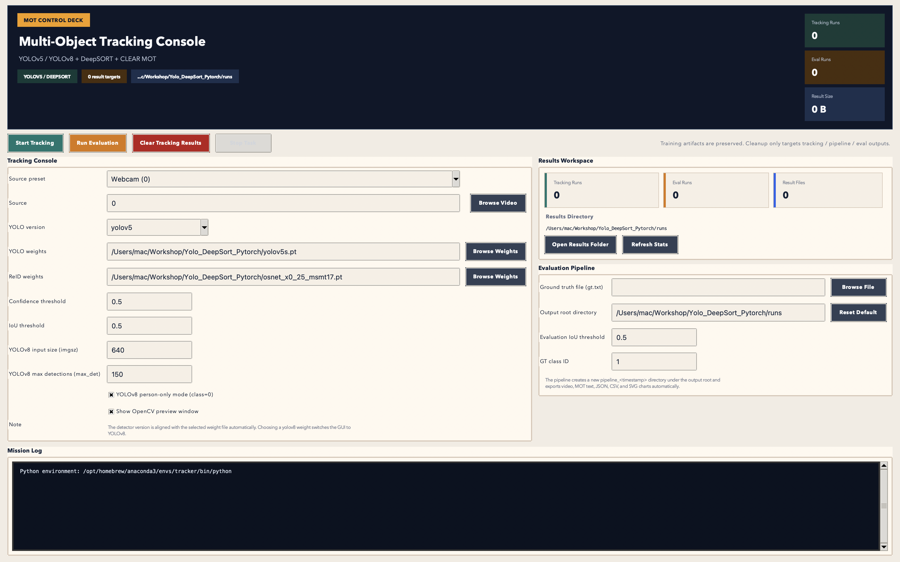

# YOLOv5/YOLOv8 + DeepSORT Multi-Object Tracking



This repository is a multi-object tracking project built around `YOLOv5` / `YOLOv8` and `DeepSORT`. It is intended for demos, coursework, experiment reproduction, and quick end-to-end validation with both CLI and GUI workflows.

## Features

- Switch between `YOLOv5` and `YOLOv8` detectors
- Run multi-object tracking with `DeepSORT + OSNet`
- Use both CLI tracking and a desktop GUI
- Run `tracking + CLEAR MOT evaluation + chart export` in one flow
- Prepare `MOT16 -> YOLO` data and train `YOLOv8` with bundled scripts

## Requirements

- Python `3.10`
- A dedicated environment such as `conda` or `venv` is recommended
- Linux GUI users may also need the system package `python3-tk`

Suggested environment setup:

```bash
conda create -y -n tracker python=3.10
conda activate tracker
pip install -r requirements.txt
```

Notes:

- `requirements.txt` reflects the currently verified working environment.
- If your platform requires a custom installation flow for `torch` / `torchvision`, install them first using the official PyTorch instructions, then run `pip install -r requirements.txt`.

## Repository Layout

```text
boxmot/                 DeepSORT and ReID core implementation
examples/               CLI, GUI, and evaluation pipeline entry points
tools/                  Dataset conversion and training scripts
docs/                   Workflow documentation
test_video.mp4          Demo video 1
test_video_2.mp4        Demo video 2
yolov5s.pt              Demo YOLOv5 weight
yolov8n.pt              Demo YOLOv8 weight
osnet_x0_25_msmt17.pt   Demo ReID weight
GUI.png                 GUI preview image
```

## Quick Start

### CLI Tracking

Run tracking with YOLOv8:

```bash
python examples/track.py \
  --yolo-version yolov8 \
  --yolo-weights yolov8n.pt \
  --reid-weights osnet_x0_25_msmt17.pt \
  --source test_video.mp4 \
  --show
```

Run tracking with YOLOv5:

```bash
python examples/track.py \
  --yolo-version yolov5 \
  --yolo-weights yolov5s.pt \
  --reid-weights osnet_x0_25_msmt17.pt \
  --source test_video.mp4 \
  --show
```

Outputs are written to `runs/tracking_<timestamp>/` by default.

### GUI

```bash
python examples/gui.py
```

The GUI supports:

- detector version switching
- source and weight selection
- live tracking preview
- one-click evaluation pipeline execution
- one-click cleanup of tracking results

### One-Command Evaluation Pipeline

```bash
python examples/run_clear_mot_pipeline.py \
  --source test_video.mp4 \
  --gt /path/to/gt.txt \
  --yolo-version yolov8 \
  --yolo-weights yolov8n.pt \
  --reid-weights osnet_x0_25_msmt17.pt \
  --show
```

The pipeline exports:

- tracked video
- MOTChallenge-format tracking results
- `summary.json`
- `chart_data.csv`
- SVG metric charts

## Dataset Preparation and Training

### Convert MOT16 to YOLO Detection Format

```bash
python tools/prepare_mot16_yolo.py \
  --mot16-root datasets/MOT16 \
  --out datasets/mot16_yolo
```

### Train YOLOv8

```bash
python tools/train_yolov8_mot16.py \
  --data datasets/mot16_yolo/mot16.yaml \
  --model yolov8n.pt \
  --epochs 50
```

Training outputs are written to `runs/train/` by default.

## More Documentation

- Workflow notes: `docs/WORKFLOW.md`
